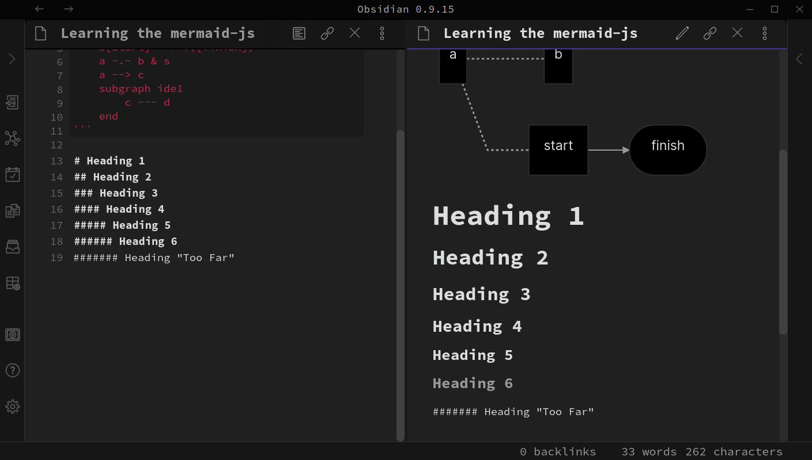

# Obsidian Simple
A custom CSS theme for Obsidian to display plain text editing

## Instructions
1. In Obsidian, click Settings->Plugins and turn on "Custom CSS".
2. Go to Settings -> Community themes to activate

## Licence
This theme makes siple modifications to Obisdian's internal CSS.
Modify at will to allow plain text editing.
